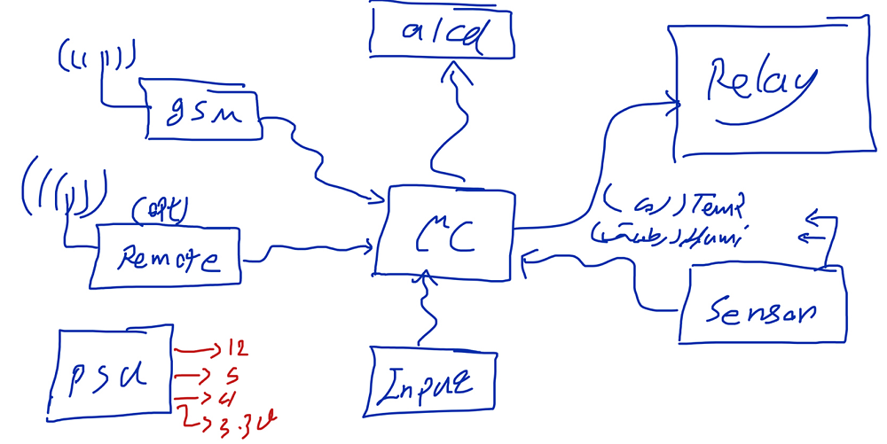

# 📲 Relay Control with SMS using an AVR microcontroller  
The RCS_AVR project is an interactive, hands-on initiative focused on remote relay control via SMS. 
It includes components like a Power Supply Unit (PSU) for multiple voltage levels, a GSM Module for SMS command processing, an AVR Microcontroller (ATMEGA328) for control logic, and various inputs and outputs for seamless interaction. 
Communication occurs through protocols like UART. 
This project provides practical insights into embedded systems, covering GSM module integration, power supply management, microcontroller interfacing, remote control mechanisms, and sensor data processing.
This project serves as an excellent platform for learning and experimenting with embedded systems, offering practical insights into real-world applications.



### 📋 Additional Details:
| Component               | Specification                        |
|-------------------------|--------------------------------------|
| **Microcontroller**     | ATMEGA328                            |
| **Operating Frequency** | 16MHz                                |
| **Programming Language**| Embedded C                           |
| **Compiler**            | avr-gcc                              |
| **Editor**              | Visual Studio Code (VsCode)          |
| **IDE**                 | PlatformIO                           |
| **PCB Design Software** | Altium Designer                      |
| **Version Control**     | Git, GitHub                          |
| **Communication Module**| GSM (Quectel MC66)                   |
| **Remote Control**      | RXB22 433 MHZ                        |
| **Display**             | Character LCD 16x2                   |
| **Output**              | Relay, SPDT, 12V, 22X16mm, 240V/7A   |
| **Temperature Sensor**  | AHT20                                |
| **5V Regulator**        | TPS54302                             |
| **4V Regulator**        | TPS54302                             |
| **3.3V Regulator**      | AMS1117-3.3V                         |


# 💻 How to Use Git and GitHub
To access the repository files and save them on your computer, there are two methods available:
1. **Using Git Bash and Cloning the Repository**
   - This method is more suitable for advanced users and those familiar with command-line tools.
   - By using this method, you can easily receive updates for the repository.

2. **Downloading the Repository as a ZIP file**
   - This method is simpler and suitable for users who are not comfortable with command-line tools.
   - Note that with this method, you will not automatically receive updates for the repository and will need to manually download any new updates.

## Clone using the URL.
First, open **Git Bash** :
-  Open the folder in **File Explorer** where you want the library to be stored.
-  **Right-click** inside the folder and select the option **"Open Git Bash here"** to open **Git Bash** in that directory.


> [!NOTE] 
> If you do not see the "Open Git Bash here" option, it means that Git is not installed on your system.  
> You can download and install Git from [this link](https://git-scm.com/downloads).  
> For a tutorial on how to install and use Git, check out [this video](https://youtu.be/BsykgHpmUt8).
  
-  Once **Git Bash** is open, run the following command to clone the repository:

 ```bash
git clone https://github.com/aKaReZa75/RCS_AVR
```
- You can copy the above command by either:
- Clicking on the **Copy** button on the right of the command.
- Or select the command text manually and press **Ctrl + C** to copy.
- To paste the command into your **Git Bash** terminal, use **Shift + Insert**.


- Then, press Enter to start the cloning operation and wait for the success message to appear.


> [!IMPORTANT]
> Please keep in mind that the numbers displayed in the image might vary when you perform the same actions.  
> This is because repositories are continuously being updated and expanded. Nevertheless, the overall process remains unchanged.

> [!NOTE]
> Advantage of Cloning the Repository:  
> - **Receiving Updates:** By cloning the repository, you can easily and automatically receive new updates.  
> - **Version Control:** Using Git allows you to track changes and revert to previous versions.  
> - **Team Collaboration:** If you are working on a project with a team, you can easily sync changes from team members and collaborate more efficiently.  

## Download Zip
If you prefer not to use Git Bash or the command line, you can download the repository directly from GitHub as a ZIP file.  
Follow these steps:  
1. Navigate to the GitHub repository page and Locate the Code button:
   - On the main page of the repository, you will see a green Code button near the top right corner.

2. Download the repository:
   - Click the Code button to open a dropdown menu.
   - Select Download ZIP from the menu.

    

3. Save the ZIP file:
   - Choose a location on your computer to save the ZIP file and click Save.

4. Extract the ZIP file:
   - Navigate to the folder where you saved the ZIP file.
   - Right-click on the ZIP file and select Extract All... (Windows) or use your preferred extraction tool.
   - Choose a destination folder and extract the contents.

5. Access the repository:
   - Once extracted, you can access the repository files in the destination folder.

> [!IMPORTANT]
> - No Updates: Keep in mind that downloading the repository as a ZIP file does not allow you to receive updates.    
>   If the repository is updated, you will need to download it again manually.  
> - Ease of Use: This method is simpler and suitable for users who are not comfortable with Git or command-line tools.

# 🎬 PCB Desing Videos
- [aKaReZa 70 - RCS, AVR - PART A](https://youtu.be/KLH8E3yOOMw)
   ---
  This first video in the series covers designing a project from idea to final product, including conceptual design, casing selection, schematic creation in Altium Designer, and more.

- [aKaReZa 71 - RCS, AVR - PART B](https://youtu.be/-EyT4b3-hQU)
  ---
  In this video, we design a 12-5-4-3.3V power supply, add fuses, and include voltage indicators.

- [aKaReZa 72 - RCS, AVR - PART C](https://youtu.be/bh53Z6KH728)
  --- 
  In this video, we review all your Issues and Pull Requests, introduce some useful software, complete the project's power supply section, and discuss upcoming channel content and plans.

- [aKaReZa 73 - RCS, AVR - PART D](https://youtu.be/vWiSh-8D4kY)
  --- 
  In this video, after designing the controller and output sections, we learn hierarchical design, create the project hierarchically, and finally generate the project's library file.

- [aKaReZa 75 - RCS, AVR - PART E](https://youtu.be/V0r4XVZA-bk)
  ---
  In this video, we cover using character LCDs, the Harness tool in Altium Designer, identifying VCC, VEE, VDD, and VSS pins, connecting a SIM card and UART protocol to a GSM module, adding power filters and a network status LED to the GSM module, and reviewing some GSM module tips. Additionally, we check the raised Pull Requests and Issues.

- [aKaReZa 79 - RCS, AVR - PART F](https://youtu.be/U1JYVCcn27k)
  --- 
  In this video, we review raised Pull Requests and Issues, organize the project, design the input section and 220V signal detection, design the code-learn remote section, fix errors, resize the board to fit the casing, introduce the "Hami Bash" section, and discuss the idea of casing installation.

- [aKaReZa 81 - RCS, AVR - PART G](https://youtu.be/6VrP90s_HFc)
  --- 
  In this video, we address the issues raised on GitHub, make several schematic changes, place components in the PCB environment, route several sections, and learn a crucial tip about capacitor placement.

- [aKaReZa 83 - RCS, AVR - PART H](https://youtu.be/ByZ2kSmf6VU)
  ---
  In this video, we continue routing the board. After completing the routes, we learn how to strengthen power paths, place screws on the board, and use the Polygon, Teardrops, and Via stitching tools.

# 📝 How to Ask Questions
If you have any questions or issues, you can raise them through the **"Issues"** section of this repository. Here's how you can do it:  

1. Navigate to the **"Issues"** tab at the top of the repository page.  

  

2. Click on the **"New Issue"** button.  
   
  

3. In the **Title** field, write a short summary of your issue or question.  

4. In the "Description" field, detail your question or issue as thoroughly as possible. You can use text formatting, attach files, and assign the issue to someone if needed. You can also use text formatting (like bullet points or code snippets) for better readability.  

5. Optionally, you can add **labels**, **type**, **projects**, or **milestones** to your issue for better categorization.  

6. Click on the **"Submit new issue"** button to post your question or issue.
   
  

I will review and respond to your issue as soon as possible. Your participation helps improve the repository for everyone!  

> [!TIP]
> - Before creating a new issue, please check the **"Closed"** section to see if your question has already been answered.  
>     
> - Write your question clearly and respectfully to ensure a faster and better response.  
> - While the examples provided above are in English, feel free to ask your questions in **Persian (فارسی)** as well.  
> - There is no difference in how they will be handled!  

> [!NOTE]
> Pages and interfaces may change over time, but the steps to create an issue generally remain the same.

# 🤝 Contributing to the Repository
To contribute to this repository, please follow these steps:
1. **Fork the Repository**  
2. **Clone the Forked Repository**  
3. **Create a New Branch**  
4. **Make Your Changes**  
5. **Commit Your Changes**  
6. **Push Your Changes to Your Forked Repository**  
7. **Submit a Pull Request (PR)**  

> [!NOTE]
> Please ensure your pull request includes a clear description of the changes you’ve made.
> Once submitted, I will review your contribution and provide feedback if necessary.

# 🌟 Support Me
If you found this repository useful:
- Subscribe to my [YouTube Channel](https://www.youtube.com/@aKaReZa75).
- Share this repository with others.
- Give this repository and my other repositories a star.
- Follow my [GitHub account](https://github.com/aKaReZa75).

# 📜 License
This project is licensed under the GPL-3.0 License. This license grants you the freedom to use, modify, and distribute the project as long as you:
- Credit the original authors: Give proper attribution to the original creators.
- Disclose source code: If you distribute a modified version, you must make the source code available under the same GPL license.
- Maintain the same license: When you distribute derivative works, they must be licensed under the GPL-3.0 too.
- Feel free to use it in your projects, but make sure to comply with the terms of this license.
  
# ✉️ Contact Me
Feel free to reach out to me through any of the following platforms:
- 📧 [Email: aKaReZa75@gmail.com](mailto:aKaReZa75@gmail.com)
- 🎥 [YouTube: @aKaReZa75](https://www.youtube.com/@aKaReZa75)
- 💼 [LinkedIn: @akareza75](https://www.linkedin.com/in/akareza75)
