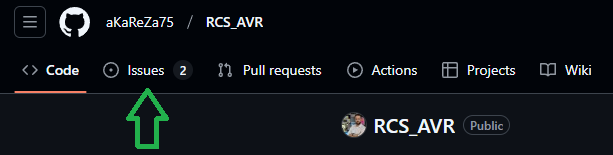

# Rrelay Control with SMS Project
The RCS_AVR project is an Embedded System AVR learning initiative with an interactive and hands-on approach. This project focuses on relay control via SMS, utilizing various components to provide a comprehensive learning experience.

This project serves as an excellent platform for learning and experimenting with embedded systems, offering practical insights into real-world applications.

### Components:
- **Power Supply Unit (PSU)**: Provides different voltage levels (12V, 5V, 4V, 3.3V) for powering the modules.
- **GSM Module**: Enables the reception and processing of SMS commands for controlling the relay.
- **Microcontroller (MC)**: Central processing unit that interfaces with all other components, executing control logic.
- **Relay**: Facilitates the switching of external devices based on SMS or remote control commands.
- **Remote Control (ASK)**: Offers remote control capabilities.
- **Input Module**: Manages inputs from keys, sensors, and other devices.
- **Sensor Module**: Monitors environmental parameters and sends data to the microcontroller.

### Communication
The components communicate through various protocols, including UART, ensuring seamless interaction and control.

### Project Status
The hardware design for the RCS_AVR project is complete. Currently, the assembly and programming phases are ongoing.

### Learning Objectives
- Understanding GSM module integration for SMS-based control.
- Managing power supply for embedded systems.
- Hands-on experience with microcontroller programming and interfacing.
- Exploring remote control mechanisms using ASK modules.
- Implementing sensor data acquisition and processing.

# PCB Desing Videos
- [aKaReZa 70 - RCS, AVR - PART A](https://youtu.be/KLH8E3yOOMw)
   ---
  This first video in the series covers designing a project from idea to final product, including conceptual design, casing selection, schematic creation in Altium Designer, and more.

- [aKaReZa 71 - RCS, AVR - PART B](https://youtu.be/-EyT4b3-hQU)
  ---
  In this video, we design a 12-5-4-3.3V power supply, add fuses, and include voltage indicators.

- [aKaReZa 72 - RCS, AVR - PART C](https://youtu.be/bh53Z6KH728)
  --- 
  In this video, we review all your Issues and Pull Requests, introduce some useful software, complete the project's power supply section, and discuss upcoming channel content and plans.

- [aKaReZa 73 - RCS, AVR - PART D](https://youtu.be/vWiSh-8D4kY)
  --- 
  In this video, after designing the controller and output sections, we learn hierarchical design, create the project hierarchically, and finally generate the project's library file.

- [aKaReZa 75 - RCS, AVR - PART E](https://youtu.be/V0r4XVZA-bk)
  ---
  In this video, we cover using character LCDs, the Harness tool in Altium Designer, identifying VCC, VEE, VDD, and VSS pins, connecting a SIM card and UART protocol to a GSM module, adding power filters and a network status LED to the GSM module, and reviewing some GSM module tips. Additionally, we check the raised Pull Requests and Issues.

- [aKaReZa 79 - RCS, AVR - PART F](https://youtu.be/U1JYVCcn27k)
  --- 
  In this video, we review raised Pull Requests and Issues, organize the project, design the input section and 220V signal detection, design the code-learn remote section, fix errors, resize the board to fit the casing, introduce the "Hami Bash" section, and discuss the idea of casing installation.

- [aKaReZa 81 - RCS, AVR - PART G](https://youtu.be/6VrP90s_HFc)
  --- 
  In this video, we address the issues raised on GitHub, make several schematic changes, place components in the PCB environment, route several sections, and learn a crucial tip about capacitor placement.

- [aKaReZa 83 - RCS, AVR - PART H](https://youtu.be/ByZ2kSmf6VU)
  ---
  In this video, we continue routing the board. After completing the routes, we learn how to strengthen power paths, place screws on the board, and use the Polygon, Teardrops, and Via stitching tools.

# 💻 How to Use Git and GitHub

First, open **Git Bash** :
-  Open the folder in **File Explorer** where you want the library to be stored.
-  **Right-click** inside the folder and select the option **"Open Git Bash here"** to open **Git Bash** in that directory.


> Note: If you do not see the "Open Git Bash here" option, it means that Git is not installed on your system.
> 
>  You can download and install Git from [this link](https://git-scm.com/downloads).
>  
>  For a tutorial on how to install and use Git, check out [this video](https://youtu.be/BsykgHpmUt8).
  
-  Once **Git Bash** is open, run the following command to clone the repository:

 ```bash
git clone https://github.com/aKaReZa75/RCS_AVR
```
- You can copy the above command by either:
- Clicking on the **Copy** button on the right of the command.
- Or select the command text manually and press **Ctrl + C** to copy.
- To paste the command into your **Git Bash** terminal, use **Shift + Insert**.


- Then, press Enter to start the cloning operation and wait for the success message to appear.


**Note:** Please keep in mind that the numbers displayed in the image might vary when you perform the same actions. This is because repositories are continuously being updated and expanded. Nevertheless, the overall process remains unchanged.

# 📝 How to Ask Questions
If you have any questions or issues, you can raise them through the **"Issues"** section of this repository. Here's how you can do it:  

1. Navigate to the **"Issues"** tab at the top of the repository page.  

  

2. Click on the **"New Issue"** button.  
   
  

3. In the **Title** field, write a short summary of your issue or question.  

4. In the "Description" field, detail your question or issue as thoroughly as possible. You can use text formatting, attach files, and assign the issue to someone if needed. You can also use text formatting (like bullet points or code snippets) for better readability.  

5. Optionally, you can add **labels**, **type**, **projects**, or **milestones** to your issue for better categorization.  

6. Click on the **"Submit new issue"** button to post your question or issue.
   
  

I will review and respond to your issue as soon as possible. Your participation helps improve the repository for everyone!  

**Tips**:  
- Before creating a new issue, please check the **"Closed"** section to see if your question has already been answered.  
     
- Write your question clearly and respectfully to ensure a faster and better response.  
- While the examples provided above are in English, feel free to ask your questions in **Persian (فارسی)** as well. There is no difference in how they will be handled!  

**Note:** Pages and interfaces may change over time, but the steps to create an issue generally remain the same.  

# 🤝 Contributing to the Repository
To contribute to this repository, please follow these steps:
1. **Fork the Repository**  
2. **Clone the Forked Repository**  
3. **Create a New Branch**  
4. **Make Your Changes**  
5. **Commit Your Changes**  
6. **Push Your Changes to Your Forked Repository**  
7. **Submit a Pull Request (PR)**  

Please ensure your pull request includes a clear description of the changes you’ve made. Once submitted, I will review your contribution and provide feedback if necessary.

# 🌟 Support Me
If you found this repository useful:
- Subscribe to my [YouTube Channel](https://www.youtube.com/@aKaReZa75).
- Share this repository with others.
- Give this repository and my other repositories a star.
- Follow my [GitHub account](https://github.com/aKaReZa75).

# 📜 License
This project is licensed under the GPL-3.0 License. This license grants you the freedom to use, modify, and distribute the project as long as you:
- Credit the original authors: Give proper attribution to the original creators.
- Disclose source code: If you distribute a modified version, you must make the source code available under the same GPL license.
- Maintain the same license: When you distribute derivative works, they must be licensed under the GPL-3.0 too.
- Feel free to use it in your projects, but make sure to comply with the terms of this license.
  
# ✉️ Contact Me
Feel free to reach out to me through any of the following platforms:
- 📧 [Email: aKaReZa75@gmail.com](mailto:aKaReZa75@gmail.com)
- 🎥 [YouTube: @aKaReZa75](https://www.youtube.com/@aKaReZa75)
- 💼 [LinkedIn: @akareza75](https://www.linkedin.com/in/akareza75)
